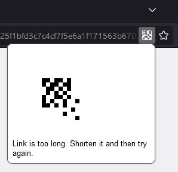

#  Qr codes

Browser extension for Firefox that allow you to quickly generate QR code for the tab you are currently on.

## Overview & Instruction

### Generating QR codes
In order to generate QR code for the current tab, a button on the link bar has to be pressed. Then if everything is in order, a QR code will appear. Longer links will require QR code of bigger size, therefore the extension will automatically scale it in order to keep the size optimal.

*Generated QR code for current tab*

Longer links will generate QR codes of suboptimal size that may lead to difficulties while scanning. The extension will inform you if this is the case. Note that there is also upper limit to the length of the link. Currently it is set to 280 characters and QR code for any longer link will not be generated.

*Generated QR code with information about its suboptimal size.*

*Error caused by a link that is too long*

## Limitations
- QR code will not be generated for any link that exceeds 280 characters

- QR codes are generated using [goQR.me](https://goqr.me/) service thus the QR code generation is regulated by their Terms of Service. You can read it here: https://goqr.me/api/doc/create-qr-code/#general_tos

## Installation
Available for Firefox via: https://addons.mozilla.org/en-US/firefox/addon/qr-codes/

In addition you may also install it as local debug install. **Note that you will have to install it every time you open the browser**
- [Installing extension locally](https://developer.mozilla.org/en-US/docs/Mozilla/Add-ons/WebExtensions/Your_first_WebExtension#installing)

## Bugs & to do
See issues on this repo